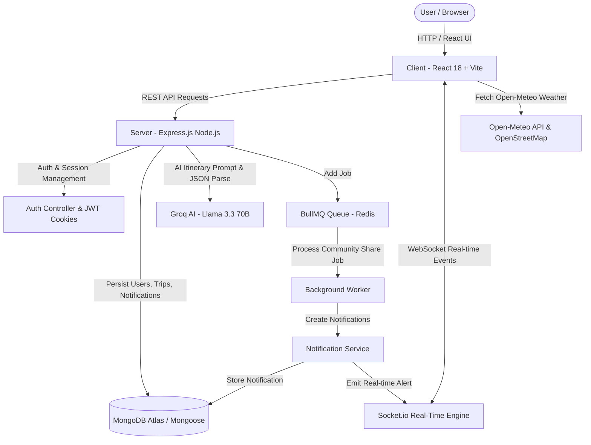

# YatrAI 🗺️

> **Your Next Indian Adventure, Planned by AI.**

[](https://yatr-ai-brown.vercel.app)
[](https://yatrai-857i.onrender.com)

YatrAI is a full-stack, AI-powered travel itinerary planner built specifically for Indian travelers. Users complete a 7-step wizard (specifying route, travel dates, group size, budget in ₹ INR, travel style, food preferences, and transport modes) to instantly receive a complete, day-by-day customized itinerary complete with hotel recommendations, estimated cost breakdowns, date-aware live weather forecasts, and community trip sharing.

---

## 🔗 Live Production Links

* 🌐 **Live Web Application (Vercel)**: [https://yatr-ai-brown.vercel.app](https://yatr-ai-brown.vercel.app)
* ⚡ **Live Express API Server (Render)**: [https://yatrai-857i.onrender.com](https://yatrai-857i.onrender.com)

---

## 🏗️ Technical Architecture & Pipeline Overview



---

## 📁 Directory & File Breakdown

### 📂 Server (`/server`)

#### ⚙️ Core Server Files
* **`server.js`**: Application entry point. Initializes Express app, HTTP server, MongoDB connection, CORS, cookie-parser, and boots Socket.io, BullMQ queues, and background reminder schedulers.
* **`.env`**: Environment variables (MongoDB URI, JWT secret, Groq API key, Nodemailer credentials, Redis configuration, Client URL).

#### 🛠️ Config (`/server/config`)
* **`config/db.js`**: Connects to MongoDB Atlas using Mongoose with connection pooling and error logging.

#### 🗄️ Database Models (`/server/models`)
* **`models/User.js`**: Mongoose schema for user profiles (name, email, hashed password, timestamps).
* **`models/Trip.js`**: Schema for trips (user ID, owner name, starting location, destination, start/end dates, group size, budget level, travel style array, food preference, transport list, day-by-day events array, recommended hotels array with ratings/pricing, estimated cost in ₹ INR, public visibility flag `isPublic`, and trip status: `draft` | `generating` | `completed` | `failed`).
* **`models/Notification.js`**: Schema for user notifications (user ID, title, message, read state, type: `trip` | `social` | `system`, and custom metadata object `data`).
* **`models/PasswordResetToken.js`**: Schema storing hashed OTPs / reset tokens with expiration timestamps for password recovery.

#### 🕹️ Controllers (`/server/controllers`)
* **`controllers/authController.js`**: Handles user registration, login (issues short-lived JWT access token in response body and httpOnly refresh token cookie), token refresh, logout, password reset OTP request, and OTP verification.
* **`controllers/tripController.js`**: Handles trip creation (`createTrip`), synchronous AI itinerary generation (`generateTripItinerary`), fetching user trips (`getMyTrips`), fetching explore feed (`getPublicTrips`), viewing single trip (`getTripById`), updating trip settings (`updateTrip`), and deleting trips (`deleteTrip`).
* **`controllers/notificationController.js`**: Handles fetching notifications (`getUserNotifications`), marking a single notification read (`markAsRead`), and marking all notifications read (`markAllAsRead`).

#### 🔒 Middleware (`/server/middleware`)
* **`middleware/authMiddleware.js`**: `protect` middleware verifies JWT Bearer tokens from authorization headers and attaches the decoded user object (`req.user`) to protected routes.

#### 🌐 Routes (`/server/routes`)
* **`routes/auth.js`**: Authentication endpoints (`/register`, `/login`, `/refresh`, `/logout`, `/forgot-password`, `/reset-password`).
* **`routes/trips.js`**: Trip endpoints (`POST /`, `POST /:id/generate`, `GET /`, `GET /public`, `GET /:id`, `PUT /:id`, `DELETE /:id`).
* **`routes/notifications.js`**: Notification endpoints (`GET /`, `PUT /:id/read`, `PUT /read-all`).

#### ⚡ Services (`/server/services`)
* **`services/groqService.js`**: Interfaces with Groq AI API (`llama-3.3-70b-versatile`). Constructs an India-tailored JSON prompt enforcing strict structured outputs (hotel recommendations with pricing in ₹ INR, ratings, area, and day-by-day events with icons and timings). Includes `generateFallbackTrip` fallback generator if Groq fails or times out.
* **`services/socketService.js`**: Manages Socket.io server instance. Authenticates incoming WebSocket connections with JWT tokens, joins user-specific rooms (`user:<userId>`), emits direct notifications (`emitToUser`), and broadcasts public trip events (`broadcastPublicTrip`).
* **`services/queueService.js`**: Configures **BullMQ + Redis** (Upstash/Local Redis). Defines `public-trip-share` queue, queue scheduler, and background worker. When a trip is published to the community feed, a job is pushed to Redis to asynchronously create notifications for all other users and emit WebSocket events without blocking the main Express HTTP thread. Includes graceful fallback to synchronous execution if Redis is unconfigured.
* **`services/notificationService.js`**: Central utility function (`createNotification`) to create and save a MongoDB notification and trigger real-time Socket.io events (`emitToUser`).
* **`services/tripNotificationService.js`**: Handles notifications on trip creation/generation and runs a background scheduler (`startTripReminderScheduler`) every 12 hours checking for upcoming trips (7 days, 3 days, 1 day, 0 days away) to automatically dispatch trip reminders.
* **`services/emailService.js`**: Uses Nodemailer (SMTP) to send password reset OTP emails.

---

### 📂 Client (`/client`)

#### 🎨 Core Client Setup
* **`vite.config.js`**: Vite build & development configuration with proxy rules routing `/api` requests to Express backend at `http://localhost:5000`.
* **`index.html`**: App entry HTML page with font preloading and meta titles.
* **`src/main.jsx`**: React DOM root rendering `<App />` wrapped in theme context.
* **`src/App.jsx`**: Defines React Router route tree (`/`, `/login`, `/register`, `/dashboard`, `/plan`, `/generate`, `/trip/:id`, `/notifications`, `/explore`, `/settings`, `/reset-password`). Wraps routes with `AuthProvider` and `ThemeProvider`.
* **`src/index.css`**: Global design system, dark mode styles, custom scrollbars, and animations.

#### 🔌 Client API & Services (`/client/src/api` & `/client/src/services`)
* **`api/config.js`**: Central API base URL configuration. Automatically switches between local dev proxy and production environment variable (`VITE_API_URL`).
* **`api/client.js`**: Central API wrapper for trip operations (`apiCreateTrip`, `apiGenerateTrip`, `apiGetTrip`, `apiGetMyTrips`, `apiGetPublicTrips`, `apiUpdateTrip`, `apiDeleteTrip`).
* **`api/auth.js`**: Authentication API calls (`apiLogin`, `apiRegister`, `apiLogout`, `apiRefreshToken`).
* **`api/notifications.js`**: Notification API calls (`apiGetNotifications`, `apiMarkNotificationRead`, `apiMarkAllNotificationsRead`).
* **`services/socket.js`**: Manages client-side Socket.io connection (`initSocket`, `subscribe`, `disconnectSocket`). Automatically connects WebSocket session using access token upon user login and listens for real-time `notification` or `tripReady` events.

#### 🧱 Shared Components (`/client/src/components`)
* **`components/Navbar.jsx`**: Responsive navbar with logo, navigation links, dark mode toggle button, profile dropdown menu, and real-time notification bell displaying active unread count via Socket.io.
* **`components/Toast.jsx`**: Floating alert component for success/error feedback toasts.

#### 🔒 Context Providers (`/client/src/context`)
* **`context/AuthContext.jsx`**: Provides global authentication state (`user`, `token`, `isAuthenticated`). Restores session on load via httpOnly refresh token cookie, manages login/logout, and syncs client Socket.io lifecycle.
* **`context/ThemeContext.jsx`**: Manages light/dark mode theme state with localStorage persistence and system preference auto-detection.

#### 📱 Application Pages (`/client/src/pages`)
* **`pages/Home.jsx`**: Landing page showcasing hero section, feature cards, sample Indian itineraries, and CTA buttons.
* **`pages/TripWizard.jsx`**: 7-step interactive trip planning wizard:
  1. From Location & Destination (Indian cities)
  2. Travel Dates (Start & End dates)
  3. Group Size (Solo, Couple, Family, Friends)
  4. Budget Level (Budget ₹, Moderate ₹₹, Luxury ₹₹₹)
  5. Travel Style (Heritage, Adventure, Relaxation, Foodie, Spiritual, Photography)
  6. Food Preferences (Vegetarian, Non-Veg, Jain, Vegan, Local Street Food)
  7. Mode of Transport (Flight, Train, Cab/Taxi, Bus, Self-Drive)
* **`pages/TripGenerator.jsx`**: Generates and displays the complete itinerary. Displays a sleek loading state while Groq AI computes the plan, then renders day-by-day tabs, places to visit with timings, hotel recommendation cards, and estimated cost breakdown.
* **`pages/TripDetail.jsx`**: Detailed view of a saved trip. Includes:
  * Full day-by-day place breakdowns
  * Recommended hotels widget with ratings & prices
  * Date-aware Smart Weather Widget powered by Open-Meteo API:
    * **Live Mode**: For trips starting today
    * **Trip Forecast Mode**: For trips starting within 16 days
    * **Outlook Mode**: Countdown view for trips further than 16 days away
  * Interactive OpenStreetMap & Leaflet integration showing trip stops
  * Export / Download Itinerary PDF button (`window.print()`)
  * Toggle Public / Private trip sharing
* **`pages/Dashboard.jsx`**: User dashboard displaying upcoming trips, trip statistics, search & filter bars, and quick action cards.
* **`pages/Explore.jsx`**: Community trip feed showcasing itineraries shared publicly by other travelers across India with one-click "Copy Trip to My Dashboard".
* **`pages/Notifications.jsx`**: Notification inbox showing trip updates, social sharing alerts, and countdown reminders with "Mark All Read" options.
* **`pages/Settings.jsx`**: Profile management page for updating display name, email preferences, theme preferences, and security settings.
* **`pages/Login.jsx`**, **`pages/Register.jsx`**, **`pages/ResetPassword.jsx`**: Authentication pages.

---

## ⚡ Real-time & Background Job Infrastructure

### 🔴 Socket.io Pipeline
1. When a user logs in, `AuthContext.jsx` invokes `initSocket(token)`.
2. Client establishes a WebSocket connection with the backend (`socketService.js`).
3. Server verifies JWT token and joins the client to a private room: `user:<userId>`.
4. When a trip is generated or a public trip is shared by another user, `emitToUser` or `broadcastPublicTrip` sends an instant event over WebSocket.
5. Client navbar and notification screens update counters instantly **without page refreshes**.

### 🐂 BullMQ + Redis Background Job Pipeline
1. When a user marks a trip as **Public** (`isPublic: true`), `addPublicTripShareJob(tripId, ownerId)` is called in `queueService.js`.
2. A job is added to the `public-trip-share` Redis queue.
3. A decoupled background **BullMQ Worker** picks up the job from Redis:
   - Populates trip details and owner name
   - Finds all other active users in MongoDB
   - Creates social notifications in MongoDB
   - Triggers Socket.io broadcast to update all connected community feeds in real-time
4. If Redis is not running or unconfigured, `queueService` gracefully degrades to process jobs synchronously without crashing.

---

## 🚀 Getting Started

### 1. Prerequisites
* **Node.js**: v18+ installed
* **MongoDB**: Local instance or MongoDB Atlas URI
* **Groq API Key**: Free API key from [Groq Console](https://console.groq.com/)
* **Redis** (Optional): Local Redis or Upstash Redis URL for background job queueing

### 2. Backend Setup
```bash
cd server
npm install
```
Create a `.env` file inside `/server`:
```env
PORT=5000
MONGO_URI=your_mongodb_connection_string
JWT_SECRET=your_jwt_secret_key
JWT_REFRESH_SECRET=your_jwt_refresh_secret
JWT_EXPIRE=15m
JWT_REFRESH_EXPIRE=7d
CLIENT_URL=https://yatr-ai-brown.vercel.app
NODE_ENV=development
GROQ_API_KEY=your_groq_api_key

# Redis (Optional for BullMQ)
REDIS_URL=redis://127.0.0.1:6379
```
Start the backend server:
```bash
npm run dev
```

### 3. Frontend Setup
```bash
cd client
npm install
```
Start the frontend development server:
```bash
npm run dev
```
Open [http://localhost:3000](http://localhost:3000) in your browser.

---

## 🧪 Tech Stack Summary

| Layer | Technology | Live Production Link |
|---|---|---|
| **Frontend App** | React 18, Vite | [https://yatr-ai-brown.vercel.app](https://yatr-ai-brown.vercel.app) |
| **Backend API** | Node.js, Express.js | [https://yatrai-857i.onrender.com](https://yatrai-857i.onrender.com) |
| **Styling** | Vanilla CSS tokens & Tailwind CSS | - |
| **Routing** | React Router v6 | - |
| **Database** | MongoDB Atlas, Mongoose ORM | - |
| **Authentication** | JWT Access Tokens + httpOnly Refresh Token Cookies | - |
| **AI Model** | Groq API (`llama-3.3-70b-versatile`) | - |
| **Real-time WebSockets** | Socket.io | - |
| **Background Queues** | BullMQ + Redis | - |
| **Weather API** | Open-Meteo Forecast API | - |
| **Maps** | OpenStreetMap & Leaflet | - |
